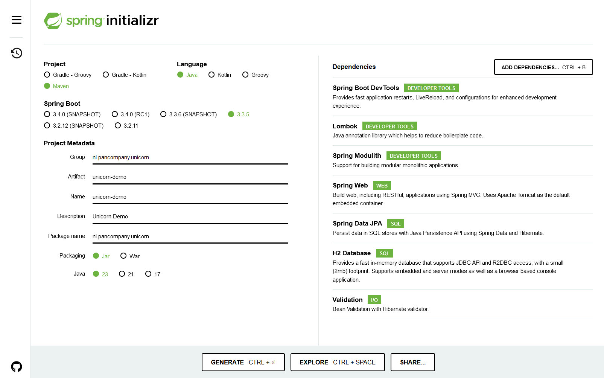

# Unicorn Demo

## Initialize project

### Class diagrams

Simplified class diagram of the unicorn bounded context:

Class diagram showing event messaging between the unicorn and magic bounded contexts:

